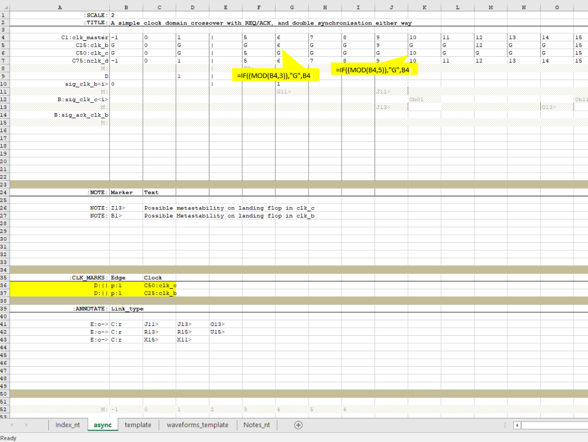
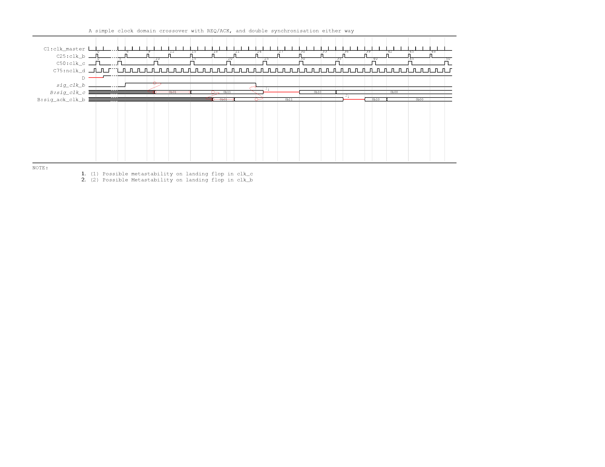

.. _async: 
================================================================================
Dealing with Asynchronous events
================================================================================

With state of the art digital design, invariable one will run into a 
requirement to represent an asynchronous event. Although
asynchronous events in a standard work flow remains strictly controlled there might
exist cases such as interfaces which are to be represented accurately. The
current parser does not provide dedicated support for asynchronous events. However, the
following tricks can be used to implement asynchronous timing events very
effectively. In most cases, the scenario revolves around some kind of clock
domain crossover. Even when the clock is not known using a virtual clock to
time the signal should still work. 

Tips for modelling async
================================================================================
* Assume we have two async clocks. For modelling purposes, these need not be
  accurate relationships. The very idea of representing async clocks is that we
  cannot use a predictable mechanism to go from one domain to another. If such
  predictable method exist we drop down to a less stringent mechanism for
  moving between multi-cycle clocks.

* Assume two clocks, say with freq 3 and 5. Use the LCM of these two clocks to
  define a master clock.

* Create the master clock. This will be rendered but has no relevance apart
  from acting as a time base for the clocks of interest ie, 3,5. For the same
  reason, we could specify an extremely low duty cycle, to provide something like
  an impulse to avoid confusion. for this clock the cycle numbers are done sequentially. 

* To create the freq5 and freq 3 clocks, we use the idea of gated clocks. ie a form like 
  1 G G G G 6 etc. 

.. caution::
   * The clocks rendered cannot achieve 50% duty cycle. If you wish to do so
     the clock has to be drawn using the signal construct. However, doing so makes
     maintenance difficult, i.e if we decide to add a cycle inbetween, the entire
     signal might need readjusting. It might just be prudent to use the defined method, but add a note to draw
     the readers attention to such irregularity. 
   * Using this method implies the pulses are
     numberd non sequentially, ie they
     assume the clock number from the master clock when active. A new derived clock
     construct may be used in the future to overcome this inconsistency.

* Rather than hand coding the waveform, a simple trick is to employ an excel
  formula such as using MOD() to decide where the clock is active; i.e.
  *mod(master_clk_cnt,5)==0 then master_clk_cnt else G* 

* repeating for the other clock with mod(master_clk_cnt,3) now provides two
  async clocks which will suffice for illustration.

* At this stage, we could use the master clock to mark edges, However this can
  be distracting.  Instead it is recommended to draw edges from both derived
  clocks. They will still be rendered in grey solid lines, as not option is
  provided yet to control the type of line. This may be extended in the future.

.. table:: Step 1 

   +---------------------------------------------------------------------------+
   |  source                                                                   |
   +---------------------------------------------------------------------------+
   |  |step1_src|                                                              |
   +---------------------------------------------------------------------------+
   |  Rendered ouptut                                                          |
   +---------------------------------------------------------------------------+
   |  |step1_rend|                                                             |
   +---------------------------------------------------------------------------+

