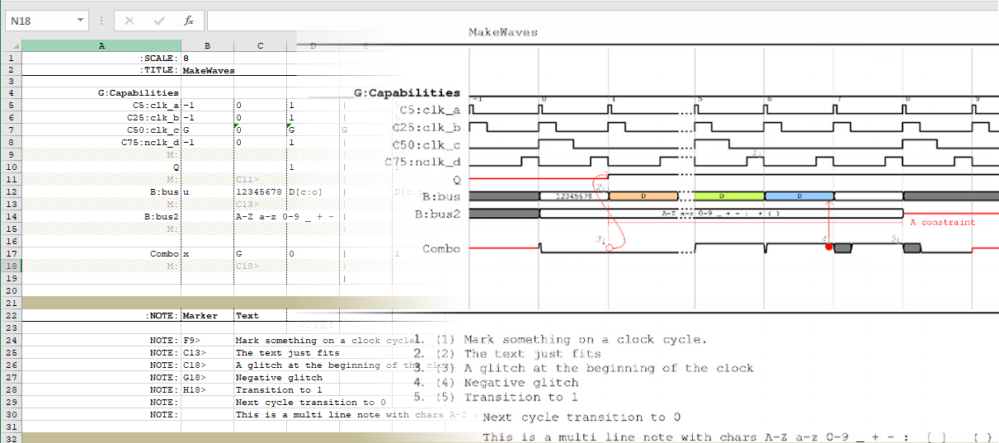

.. _intro:

================================================================================
Intro
================================================================================



Motivation
================================================================================

Provide a simple scripted interface to produce timing diagrams to facilitate an
accurate concise representation of RTL design intent much like that possible
with synthesizable HDL.::

    + Maintain consistent style and output
    + Decouple stylization from source
    + Ease maintenance by reducing overheads
    + Rich feature set to annotate waveforms.
    + possible Tex Integration/automation for scientific documentation.
   
 
Species spotted in the wild
````````````````````````````````````````````````````````````````````````````````
.. table:: Comparisons of similar tools

    ================= =============== ===============================================
    Tool name         License         Notes:
    ================= =============== ===============================================
    TimingDesigner    yes             - Stood the test of time.
                                      - Good for datasheet.

    TimingEditor      No              - GUI based 

    TimingGen         No              - GUI based 

    TimingAnalyzer    No\*            - (Java + Jython scripts) 
                                      - Remarkably Like TimingDesigner
                                      - in beta, opensourced

    WaveDrom          No              - browser based
                                      - good for simple diagrams.

    tikz-timing       No              - Latex Bundle(steep learning), Error prone
                                      - extensible with well rendered output
                                      - However we could wrap TeX to hide
                                        complexity**

    visio             yes             - Templated vector editor
                                      - Time consuming, high maintenance overhead
                                      - Variable Quality of outputs

    word/ppt/excel    yes             - diagram mode based on visio 

    vector editors    yes/no          - inkscape/omnigraffle etc.
    ================= =============== ===============================================

Why another method?
````````````````````````````````````````````````````````````````````````````````
Most tools emulate the familiar look feel and functionality of timing designer.
They are great for producing data sheets or capturing characterized I/O timing,
However they some what lack when it comes to capturing and communication logic
design intend. Advanced features offered by TimingDesigner seem excessive for
pure clock referenced digital design tasks were the meaning is captured best by
way of dependencies, flow graphs and annotations. WaveDrom comes close to this
objective with a simple clean intuitive method to produce consistent renders.
However it soon hits the limit for more complicated waveforms

How is **MakeWaves** different?
````````````````````````````````````````````````````````````````````````````````

**MakeWaves** started with the objective of drawing consistent timing diagrams
from a seemingly crude, but quick mark-up description of the logic function in a
manner similar to a value change dump. Under the hood it invokes Latex with
appropriate libraries, and tries to conceal the required heavy latex mark-up
from the user. The diagram is defined with simple intuitive mark-ups capable
of abstracting information typically in a timing diagram, with an easy
template, allowing diagrams to be rendered from a tabular form in Excel. 

Why use Excel or a similar utility?
````````````````````````````````````````````````````````````````````````````````
Digital design waveforms in most cases can be represented with tabular data. A
spreadsheet application provides a simple, familiar tabular interface which
can often be intuitive for waveform entry. Further, simple formulas and
rudimentary intelligence provided by \*office can be used advantageously to
generate a consistent maintainable and reproducible waveform. A drawing
application can be used, but are often limited by maintainenance overheads and
associated effort. Further, our observation colncludes that significant time is
often spent on aligning and positioning elements, than creating content.
**MakeWaves** provides a work flow with human readable intermediate files at
most stages. We have choses a tool chain based on some of the most
used/familiar languages and tools namelsy  Python, TeX excel and should thus
provide easy extensibility to the basic feature set::
           
    .xlsx ---> .csv ---> .tex ---> pdf,svg,png
          (py)      (py)     (TeX)

For example, the Excel step can be bypassed and a csv generated directly, for
example by parsing a VCD. This can then be back annotated if required. At the
moment this flow is still conceptual but python/tcl/perl scripts could be
deployed to parse plain vcds and provide the required translation. The method
still would not be straightforward as vcd's capture value change by time units,
not active clock edges. Another method is to use webfroms as a mechanism for
design entry. or even write in csv directly using a well configured text
editor.  Writing raw tex is also an option, but it can be error prone,
especially when dealig with annotations.

The original source xlsx is a .zip of several xml files which are interpreted by
excel. So ideally this unzipped version can be maintained under version control
thus avoiding the need for versionaing a binary file. There might even be
automation available within a versioning system suchas Git which could make this
process transparent. 

In addition to traditional source code veroning systems, cloud based storage
with office integration such as those provisioned by iShare might be another
form of revision control. 

In terms of the Dreaded USP
--------------------------------------------------------------------------------
* provides a consitent less fiddly method for annotation.
* build on what was lying around in the shed.
* a method to deploy tikz-timing within TeX.
* nothing proprietary. Implement/improve/enhance some scripting and modify to
your hearts content. It was all done in about 2 weeks. The documentation
dragged along for  months!


