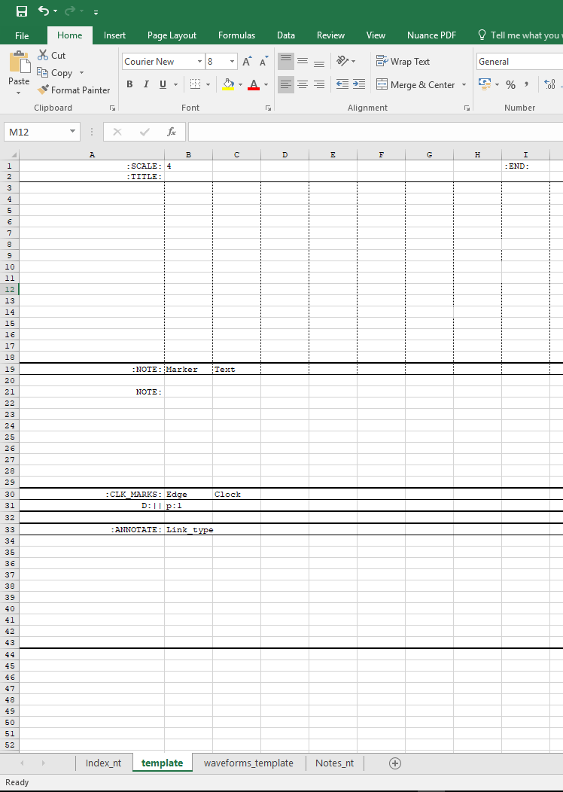

.. _intro:

================================================================================
Intro
================================================================================

.. figure:: ./images/title_image_merge.png
   :scale: 60%
   :alt: An empty template

Motivation
================================================================================

Provide a simple scripted interface to produce timing diagrams to facilitate an
accurate concise representation of logical design intent.
    + Maintain consistent style and output
    + Decouple stylization from source
    + Ease maintenance by reducing overheads
    + Rich feature set to annotate waveforms.
    + possible Tex Integration/automation for scientific documentation.
    
Species spotted in the wild
````````````````````````````````````````````````````````````````````````````````
.. table:: Comparisons of similar tools

    ================= =============== ===============================================
    Tool name         License         Notes:
    ================= =============== ===============================================
    TimingDesigner    yes             - Stood the test of time.
                                      - Good for datasheet.

    TimingEditor      No              - GUI based 

    TimingGen         No              - GUI based 

    TimingAnalyzer    No\*            - (Java + Jython scripts) 
                                      - Remarkably Like TimingDesigner
                                      - in beta, opensourced

    WaveDrom          No              - browser based
                                      - good for simple diagrams.

    tikz-timing       No              - Latex Bundle(steep learning), Error prone
                                      - extensible with well rendered output

    visio             yes             - Templated vector editor
                                      - Time consuming, high maintenance overhead
                                      - Variable Quality of outputs

    word/ppt/excel    yes             - diagram mode based on visio 

    vector editors    yes/no          - inkscape/omnigraffle etc.
    ================= =============== ===============================================

Why another method?
````````````````````````````````````````````````````````````````````````````````
Most tools emulate the familiar look feel and functionality of timing designer.
They are great for producing data sheets or capturing characterized I/O timing,
However they some what lack when it comes to capturing and communication logic
design intend. Advanced features offered by TimingDesigner seem excessive for
pure clock referenced digital design tasks were the meaning is captured best by
way of dependencies, flow graphs and annotations. WaveDrom comes close to this
objective with a simple clean intuitive method to produce consistent renders.
However it soon hits the limit for more complicated waveforms

How is **MakeWaves** different?
````````````````````````````````````````````````````````````````````````````````

**MakeWaves** started with the objective of drawing consistent timing diagrams
from a seemingly crude, but quick mark-up description of the logic function in a
manner similar to a value change dump. Under the hood it invokes Latex with
appropriate libraries, and tries to conceal the required heavy latex mark-up
from the user. The diagram is defined with simple intuitive mark-ups capable
of abstracting information typically in a timing diagram, with an easy
template, allowing diagrams to be rendered from a tabular form in Excel. 

Why use Excel or a similar utility?
````````````````````````````````````````````````````````````````````````````````
Digital design waveforms in most cases can be represented with tabular data.  A
spreadsheet application provides a simple, familiar tabular interface which
can often be intuitive for waveform entry. Further, simple formulas and
rudimentary intelligence provided by \*office can be used advantageously to
generate a consistent maintainable and reproducible waveform. A drawing
application can be used, but are often limited by maintainenance overheads, and
a significant effort overhead. While using such an application significant time
is often spent on aligning and positioning elements.
**MakeWaves** provides a work flow with human readable intermediate
files at many stages. Python and TeX should provide easy extensibility to the
basic feature set::
           
    .xlsx ---> .csv ---> .tex ---> pdf,svg,png
          (py)      (py)     (TeX)

As an example, the Excel step can be bypassed and a csv generated directly,
for example by parsing a VCD. This can then be back annotated if required. At
the moment this flow is still conceptual but python/tcl/perl scripts could be
deployed to parse plain vcds and provide the required translation. The method
still would not be straightforward as vcd's capture value change by time units,
not active clock edges.

The original source xlsx is a .zip of several xml files which are interpreted by
excel. So ideally this unzipped version can be maintained under version control
thus avoiding the need for versionaing a binary file. There might even be
automation available within a versioning system suchas Git which could make this
process transparent. 

In addition to traditional source code veroning systems cloud based storage
such as those provided by iShare etc with windows integration might be another
form of revision control

In terms of the Dreaded USP
--------------------------------------------------------------------------------
* provides a consitent less fiddly method for annotation.
* build on what was lying around in the shed.
* a method to deploy tikz-timing within TeX.
* nothing proprietary. Implement/improve/enhance some scripting and modify to your hearts content. It was all done in about 2 weeks. The documentation dragged along for  months!

================================================================================
Getting Started
================================================================================


Pre requisites
================================================================================


Excel
````````````````````````````````````````````````````````````````````````````````
* Some version of Excel capable of saving an XLSX file recommended
* Open Office and Libre Office should also work but not exhaustively tested. 
* Recommended to start from the diagramming template provided within the
  package

python 2,7
````````````````````````````````````````````````````````````````````````````````
* Current implementation is in python 2.7 , This will be migrated to 3 sometime
  in the future.
* python requires the following packages 

  * xls2csv
  * openpyxl

.. code-block:: shell

    $ python -c 'import pkgutil; print(1 if pkgutil.find_loader("xls2csv") else 0)'
    1
    $ python -c 'import pkgutil; print(1 if pkgutil.find_loader("openpyxl") else 0)'
    1

Latex
````````````````````````````````````````````````````````````````````````````````
* TexLive or MikTex for latex. These are usually found bundled in linux
  distributions. MikTex can be installed on windows/Mac etc.

  * texlive/2016 is known good 

Get the scripts
````````````````````````````````````````````````````````````````````````````````

Clone from

.. code-block:: shell 

    $ git clone /work/scratch3/nairajay/waveform_draw


Snap shot of directory:

.. code-block:: shell

    7867  2018-04-11 17:08 README
    2743  2018-04-09 17:01 read_xlsx_val.py
    26677 2018-04-10 13:28 draw_wave_tex.py
    59733 2018-04-10 14:19 waveforms_template.pdf
    27277 2018-04-10 12:57 waveforms__template.xlsx
    6071  2018-04-10 14:21 run.sh

Versions
--------------------------------------------------------------------------------

v1.1:
    Changes to the intermediate CSV to use ';' instead of '.' as the delimiter.
    This has the knock on effect that the Annotation type can no longer have B|C:c:r
    This was anyway not used, so changed to B|C:r where B,C still works as chained i
    or baseline mode and  :r selects the annotation colour.
    :r is the default and cannot be over overridden, it is not Christmas yet!. 

Putting it to work
================================================================================

    *  Usage with the wrapper script
    *  Understanding Common Errors
    *  MISC set-up info that might be useful

The push-button wrappper script run.sh
--------------------------------------------------------------------------------

tcsh command line:

.. code-block:: shell

  ./run.sh -wb *<workbook.xlsx>* [ -ws *<sheet_name>* | -all | -active ] -disp

* -wb : workbook file name with xlsx extension

  * -ws : Name of the sheet within the worksheet
  * -all: All available sheets within the specified workbook 
  * -active : The active worksheet, which is the worksheet in focus when the
    file was saved.

* -disp : display the rendered output with xpdf

#. Generate a waveform description in the XL file by filling in clocks and
   signals.  The description is similar to a value change dump where only a
   change/transition needs to be recorded 

   Details of this can be found embedded in the example
   *waveform_template.xlsx* file. This file has 3 sheets, a file can have as
   many sheets as required.  Each sheet can be converted individually or all
   sheets can be converted in batch mode as described below.  Sheets can be
   exempt by adding the suffix '_nt' to its name.  If not, when the sheet is
   not empty a conversion will be attempted. Failing to comply with the
   template some random Tex error will be generated.  Please note tex errors
   are difficult to debug. 

   When converted in batch mode, by **-all** an option step will collate all the
   individual pages into one pdf file which is named <workbook_name>.pdf 
   
   The recommended approach to start a new waveform is by making a copy of the
   template sheet by right clicking on the tab and choosing copy.  Once the copy
   is made, and suitably renamed, the contents of the cells in the waveform area,
   NOTES. CLK_MARKS, ANNOTATE can all be cleared (select rows and delete).  The
   waveforms_template sheet can additionally be renamed with _nt suffix so that it
   is never converted but available as reference. This sheet is protected with no
   password.  The recommended methods for efficiently creating a waveform is
   detailed as cell comments. 

   Both Microsoft Excel and LibreOfficei can generate a compatible xlsx file.

#. Save this file. **Saving is important** as XL will generate values from formulas.
   Also the sheet that is in focus at the time of save will become the active
   sheet.

.. note::

  | **Q: Can the file be Directly saved to the H drive?**
  |    The file can be saved directly to the H drive, However, sometimes Excel
  |    would report the file to be read only and refuse to save.  In such instances,
  |    Save with a different name and save as with the old name rectifies the problem

#. For batch conversions of all sheets from a workbook use
  
.. code-block:: shell

  ./run.sh -wb waveforms_all.xlsx -all
 
To convert all sheets that are non empty. A sheet is empty if it has
no valid cell.  A sheet might unintentionally be classified as non empty, in
such case delete the sheet or add _nt' to the end of the sheet name. This can
be useful with sheets used to capture additional info. 

#. Rendering only the active sheets are useful in closing the description-render cycle

.. code-block:: shell

  ./run.sh -wb waveforms_all.xlsx -active -disp

or explicitly specifying the -ws sheet_name

.. code-block:: shell

  ./run.sh -wb waveforms_all.xlsx -ws <sheet_name> -disp

Use **-disp**, to open the rendered result. -disp can also be avoided, but a
previously opened pdf reloaded. However, if the pdf is open from windows,
tex will generate an ERROR. Please Refer ERROR section.


Common ERRORS:
================================================================================

#. Nature of Error when the CLK_MARKS section is enabled but no clock is defined
   i.e the clock column is '0' or empty. Ideally this should be the exact copy 
   of the clock for which the timing cycles are to be drawn, reference in the
   cell as =<cell_containing_the_name_of_the_clk>.

   In certain cases, although an end is specified excel wrongly calssifies
   cells beyond END as containing data. Simple resolution is to select i a few columns
   after END and delete them

.. code-block:: shell

    Traceback (most recent call last):
      File "./draw_wave_tex.py", line 565, in <module>
        tex_blk_drawedges = draw_edge_lines(signal_array, clock_edges,clk_filter, indent_level, marked_edges, tex_blk_drawedges)
      ...
      ...
    sre_constants.error: nothing to repeat
    ERROR: waveforms_template.tex convesion failed

#. Error when the pdf is open by another application, normally from windows.

.. code-block:: shell

    ERROR:!I can't write on file `waveforms_template.pdf'.
           (Press Enter to retry, or Control-D to exit; default file extension is `.pdf')
           Please type another file name for output
           ! Emergency stop.

#. Nature of the error when '...' get replaced with the Unicode equivalent. 

.. code-block:: shell

    Traceback (most recent call last):
      File "read_xlsx_val.py", line 68, in <module>
        result = convert_to_csv(ws_active)
      File "read_xlsx_val.py", line 24, in convert_to_csv
        csv_f.writerow([cell.value for cell in row])
    UnicodeEncodeError: 'ascii' codec can't encode character u'\u2026' in position 6: ordinal not in range(128)


MISC Notes
================================================================================


Getting hold of Required packages
--------------------------------------------------------------------------------
Script uses the following packages

* xls2csv 
* openpyxl

.. note::

    There is a specific version check for python, at the moment this is hardcoded
    to 2.7.10, you may override this in the script.

The following is needed for xlstocsv conversion from command line

.. code-block:: shell

    mkdir -p /home/nairajay/local/lib/python2.6/site-packages/

The required packages for python may not be available on the host or a
managed system. Python allows mechanisms to install them locally. Creating
virtual env is another option.
With both pip available and access to the outside world, pip_install --user should
suffice for majority of the cases. This should default to ~/.local/ and
python would search this path by default.

.. code-block:: shell

    mkdir -p /home/nairajay/local/lib/python2.6/site-packages/

    pip_install --user <package> 

A messy way is to use easy_install or using the set-up.py from a tarball. Both
these can lead to problems.

.. code-block:: shell

    echo $PYTHONPATH

    # append if not empty
    # Note: python version specific
    setenv PYTHONPATH /home/<user>/local/lib/<python_version>/site-packages
    # run once
    easy_install --prefix=$HOME/local xlsx2csv


Using the anaconda distribution
--------------------------------------------------------------------------------

Example commands

.. code-block:: shell

    module use /opt/ipython/modulefiles
    module load ipyhton 

    module load texlive/2016
    # sometimes it might complain about the tikz-timing library, just use what is
    # available, Seem to work

    python ./draw_wave_tex.py waveforms_cancel_sane.csv waveforms_cancel_sane.tex
    pdflatex waveforms_cancel_sane.tex
    pdflatex -interaction=nonstopmode waveforms_cancel_sane.tex

    inkscape -z -f waveforms_cancel_sane.pdf -l waveforms_cancel_sane.svg

    # Push button script
    ./run.sh -wb waveforms_all.xlsx -all -disp
    -disp : open xpdf after every render
    -all  : process all non empty sheets in xlsx, A sheet is considerd non empty if atleast one cell has a value.
            Check for validity of a sheet for parsing to produce waveforms is not considered.
    -active: render only the active sheet. Along with display can be used for development.
    <-ws sheet_name> : provide the explicit sheet name.
    
    svg: By default svg and png are generated. scg's are generally large files and hence the default dfeature will be turned off in the future.
   



   The starting excel template.

   The cell boundaries allow easy segmentation of various areas. This empty
   template will not compile or generate a waveform.

