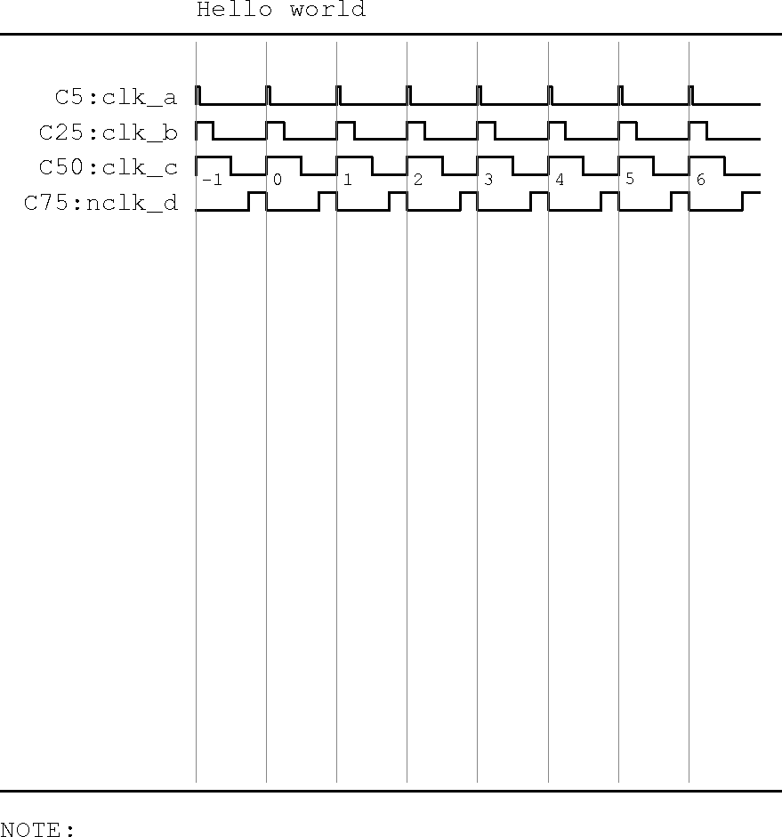

.. _step_by_step: 

================================================================================
Markup for signal names
================================================================================

Clock
================================================================================
  * add the cycle numbers, not doing so at least till **:END** leads to errors
  * Add one clock to the CLK_MARKS section. 

  * The clock name shall have **clk_xxx** in it
 
  * Mark-up for clock is **C<duty>:** where duty is the duty cycle of the clock.
 
  * If the clock name contains **nclk\_** an inverted clock will be drawn




.. table:: Step 1 

   +---------------------------------------------------------------------------+
   |  source                                                                   |
   +---------------------------------------------------------------------------+
   |  |step1_src|                                                              |
   +---------------------------------------------------------------------------+
   |  Rendered ouptut                                                          |
   +---------------------------------------------------------------------------+
   |  |step1_rend|                                                             |
   +---------------------------------------------------------------------------+

Signal
================================================================================
*   Signals have no markers and represent a single bit
*   The first columns is used for the initial condition, which is 1, 0 or x.
*   When the first row is empty, parser emits a warning and insert an x
*   For a transition, place a 1 in the corresponding clock column. This
    specifies the state of the signal following the active clock edge at the start
    of the cell. i.e the clock edge at its left boundary.  
*   To transition back place a 0 in the immediate clock. 
*   A seq 010 draws a pulse
*   Only value changes are required to be captured. 


.. table:: Step 2 

   +---------------------------------------------------------------------------+
   |  source                                                                   |
   +---------------------------------------------------------------------------+
   |  |step2_src|                                                              |
   +---------------------------------------------------------------------------+
   |  Rendered ouptut                                                          |
   +---------------------------------------------------------------------------+
   |  |step2_rend|                                                             |
   +---------------------------------------------------------------------------+

Bus 
================================================================================
* Buses use the mark-up **B:<name>**
* Buses take on the additional state 'u' in addition to 'x'
* U|u is rendered shaded to represent a don't care value.
* x is used interchangeably az HiZ on the bus. 
* Buses also follow value change representations.
* A valid value is interpreted when a non u|x character is present by itself in the cell.

  * Bus values can be coloured with one of four colours by appending [c:o|r|g|b]
  * o - orange, r- red ...get the picture
  * use colours sparingly, only if you absolutely need to.

* characters from the set A-Z a-z0-9_+-:\*() with or without space are supported

.. note:: 

  * Reccomended to use atmost 8 char for values of data. More characters may be used but 
    they tend to overflow the space allocated for a clock when used with scale 4.

.. caution::
  While colours are provided their grey scale weights have not been chosen appropriately. Thus use of colours may be confusing in grey scale prints.

In the example below, bus illustrates use of colouring.
Bus2 has no initial condition defined and the annotation although starts from cell C13 overflows into adjacent cells within excel. Since there is no value change in subsequent cells they are rendered cleanly. The example demonstrates characters that can be used for the annotation, as well as the use of x to render Hiz 

.. |step3_src| image:: ./images/step3_src.png
    :scale: 100%
    :height: 600px
    :width: 600px


.. table:: Step 3 

   +---------------------------------------------------------------------------+
   |  source                                                                   |
   +---------------------------------------------------------------------------+
   |  |step3_src|                                                              |
   +---------------------------------------------------------------------------+
   |  Rendered ouptut                                                          |
   +---------------------------------------------------------------------------+
   |  |step3_rend|                                                             |
   +---------------------------------------------------------------------------+

Text Decoration
````````````````````````````````````````````````````````````````````````````````
The text decoration on a signal name can be additionally controlled by
appending any of the following modifiers to the name.  

    * <i> Italics
    * <b> Bold
    * <b><i> bold italics

The motivation to include such modifiers is to enhance communication. For
example a signal of interest may be picked out in bold, but a place holder (ie
signal name used is not the exact name in design, or a group of signals used
for capturing design intent) may be optionally marked in italics. As an example
<addr_phase> or <intr_packet>, which collects all co samples signals which have
the same timing during an address phase, or the output of the interrupt router.
It is often convenient and effective to abstract away trivial detail such as
individual signal names when drafting a conceptual idea.

Other Enhancements 
================================================================================

Breaks
````````````````````````````````````````````````````````````````````````````````

* Waveform breaks may be added by placing a | in the columns representing break.
* It is recommended that all rows of the column within the waveform window  carry '|'
* Marker rows are automatically exempted. This allows free insertion of marker rows and reducing the chance of parser errors. 
* While rendering a break, the state before the break is extended across the break. Thus a text annotation on a bus will continue across the break.

.. caution::
  some gotchas around this yet to be resolved. The parser does not break, but if it does not produce result as expected it is reccomended to flank the break and avoid toggles.

Gated Clock
````````````````````````````````````````````````````````````````````````````````
* To render a gated clock use G in the cell where the clock is to be gated off.
* These mark-ups can also be used to create divided clocks.

.. tip::
  Instead of manually placing 'G' in cells to create gated clocks, a reccomended method would be to pick a row that lies after the  
    - as an example  to generate clk_c below.
    - =IF((MOD(B51,3)),"G",B51) will replace all except every 3rd clock with G rendeinrg a div by 3 clock. Row 51 just contains an ascending count


Glitches
````````````````````````````````````````````````````````````````````````````````
* A mechanism is provided to draw a glitch. A Glitch will be drawn just following the clock edge assuming the Cell contents represents 'Q' as opposed to 'D' The above is only for interpretation as Q values don't glitch. 
* the utility of a glitch is in representing a combo signal, for example  a req that can be taken away w/o an ack. So here the glitch demonstrates intent and behaviour rather than a purely physical signal glitch. 
* Mark-up used is **G** by itself on a signal row.
* Direction of glitch is inferred from the bounding signal levels. A glitch does not make much sense unless both the pre and post states are logically opposed to the glitch state. 


Combinatorial, Late arriving signals.
````````````````````````````````````````````````````````````````````````````````

* A class is added to draw a combinatorial or late arriving signal. This provides a mechanism to accurately communicate intent, and a hint as to how the signal is to be implemented. An example of such a signal would be a ready, or ack.
* Mark-up for rendering such a transition is to replace 1 with **0.75** to produce a delayed transition to 1
* Mark-up for rendering such a transition is to replace 0 with **-0.75** to produce a delayed transition to 0 

.. note::
  When 0.xx or -0.xx is used to add an uncertainity to a combo signal the actual fraction has no relevance. the transition region always defaults to 25% of the clock.


The example below illustrates, glitches, gated clocks(clk_c), combo uncertainty and breaks


.. table:: Step 4 

   +---------------------------------------------------------------------------+
   |  source                                                                   |
   +---------------------------------------------------------------------------+
   |  |step4_src|                                                              |
   +---------------------------------------------------------------------------+
   |  Rendered ouptut                                                          |
   +---------------------------------------------------------------------------+
   |  |step4_rend|                                                             |
   +---------------------------------------------------------------------------+

Markup for annotations. 
================================================================================

Creating a markup row.
````````````````````````````````````````````````````````````````````````````````
In order to add annotations, the parser relies on marked points in the timing
diagram.  The markers can only be placed on a cycle boundary, and this cycle
boundary coincides with the grid on the excel template, which in turn times the
fastest clock.

    * Markers are created on a special row placed under the signal of interest with
      mark-up **M:** in the signal name column. 
    * The marker points to the edge
      flanking the right of the cell where it is placed. This is visually encoded
      with '>', as in example.
    * To place a marker, it is best to use a formula. The formula puts the position
      of the cell ie column and row along with >, such as 'H31>'
    * =CONCATENATE(SUBSTITUTE(CELL("address"),"$",""),">") will make the naming consistent when row names exceed Z

.. note::

    * *=CONCATENATE(CHAR(COLUMN()+64)&ROW(),">")*, was the excel formula used previously.
    * This has been replaced with the robust method above. The simple formula existed in  earlier versions where the scale was fixed and consequently the number of columns was contained. With a relaxed scale the number of columns can grow.
    * If the note does not appear explicitely marked, change to formula above.

    * When using the template, adding the mark-up M: will conditionally format the
      entire excel row to a hatched pattern. Although the parser does not see or use
      this information it is of great benefit at design entry. 

Annotation.
````````````````````````````````````````````````````````````````````````````````
Once the markers are placed, they can be used in annotations. Refer section for mark-up.

There are two categories of annotations
    #. A label with a note to give explicit information a,r,t to a specific location in the waveform.
    #. Relationship and flow patterns. 

Adding a note
--------------------------------------------------------------------------------


.. table:: Step 5 

   +---------------------------------------------------------------------------+
   |  source                                                                   |
   +---------------------------------------------------------------------------+
   |  |step5_src|                                                              |
   +---------------------------------------------------------------------------+
   |  Rendered ouptut                                                          |
   +---------------------------------------------------------------------------+
   |  |step5_rend|                                                             |
   +---------------------------------------------------------------------------+


The example below illustrates, glitches, gated clocks(clk_c), combo uncertainty and breaks

.. tip::

   #. It is possible to get carried away with annotation marks. As a
      consequence excel could look a bit daunting. Fortunately Excel does
      provide a nifty trick to evaluate dependencies.
   #. Make sure File > Options > Advanced : Display options for this workbook-> all is ticked. 
   #. Click on a cell that contains a formula to trace.
   #. From Formulas -> Formula Auditing -> Trace Precedents/Dependents
   #. Excel will draw some arrows showing precedent/dependent depending on what is in the cell.

      #. **Use dependent to check who reference the cell.** This is the
         interesting case providing backwards reference.
      #. Use Precedent to check which cells are reference by formula (double
         clicking the cell automatcally does this)

   #. These buttons can be added to the quick access tool bar via the rt click
      contextual menu of the menu item.

   #. The arrow in excel is transient. ie it will be lost when you save the document.

Adding relationsips
--------------------------------------------------------------------------------

.. table:: Step 6 

   +---------------------------------------------------------------------------+
   |  source                                                                   |
   +---------------------------------------------------------------------------+
   |  |step6_src|                                                              |
   +---------------------------------------------------------------------------+
   |  Rendered ouptut                                                          |
   +---------------------------------------------------------------------------+
   |  |step6_rend|                                                             |
   +---------------------------------------------------------------------------+


Enhancing Excel source readability
--------------------------------------------------------------------------------
Simple excel tricks are deployed to improve the design-render cycle. 
These techniques are bundled in template2 sheet. either template may be used as per convenience.
The key areas to benefet are

    #. using some conditional formatting to render a primitive waveform in
       excel. The conditional formatting modifies cell boundaries based on its content
       and type of signal. 

    #. Using Excels dependency/precedent chasing mechanism to show annotations and their positions.
       The example below have them added to the the quick access tool bar. See
       the Red boxes.  Please note, this is not showing the dependencies that will be
       rendered, instead shows which annotation mark is used where within the source


.. table:: Excel tricks 

   +---------------------------------------------------------------------------+
   |  source                                                                   |
   +---------------------------------------------------------------------------+
   |  |excel_tricks|                                                           |
   +---------------------------------------------------------------------------+


